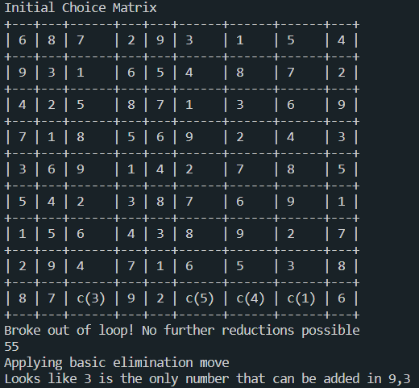
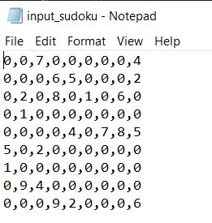

# Human Sudoku Solver
> "There is no guessing in the game of Sudoku"  

A sudoku is a logical puzzle that aims to fill a grid of 9 x 9 slots with numbers according to certain constraints.

By devising a set of moves, the game can be solved through
  * a choice of numbers for a slot
  * reductions to reduce possible choices for other slots.  

This application aims to provide a set of moves that can help solve a sudoku in a structural method by choosing the next move only based on knowledge available at the current instant and provide the explanation for the same. This can assist a person in solving the sudoku.  

# Instructions

* Before running the application, run the below command.    
  `pip install -r requirements.txt`
* Add the Sudoku you wish to solve in input_sudoku.txt

* To check if the sudoku is valid and has only one solution,  
  `python check_solvable.py`
* To obtain the solution as a sequence of steps,  
  `python terminal.py`
